# Dblue GA Tracker on Shopify

## 1. Create Custom Dimensions

Go to the Google Analytics Admin view, in the Property section, go to Custom Definitions > Custom Dimensions. Add the following dimensions:

1. ClientID with the User scope
   Click the +New Custom Dimension button. Add the name "ClientID" and choose the User scope.

   

1. SessionID with the Session scope
   Click the +New Custom Dimension button. Add the name "SessionID" and choose the Session scope.

   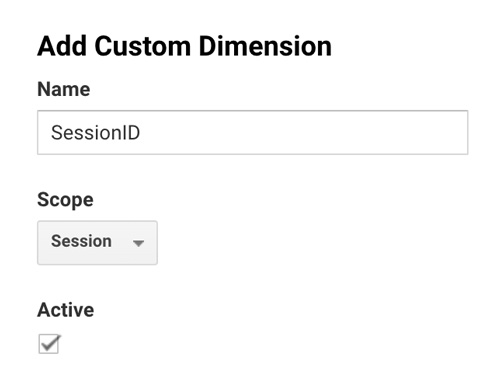

1. (Optional) UserID with the User scope.
   Click the +New Custom Dimension button. Add the name "UserID" and choose the User scope.

   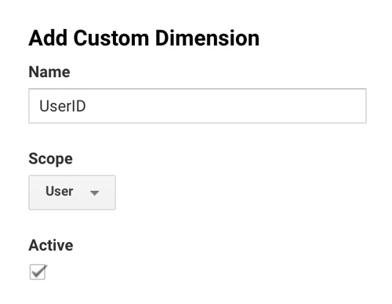

1. (Optional) HitId with the Hit scope.
   Click the +New Custom Dimension button. Add the name "HitId" and choose the Hit scope.

1. (Optional) HitTimestamp with the Hit scope.
   Click the +New Custom Dimension button. Add the name "HitTimestamp" and choose the Hit scope.

1. (Optional) HitType with the Hit scope.
   Click the +New Custom Dimension button. Add the name "HitType" and choose the Hit scope.

After adding all custom dimensions, it will look similar to the below one.

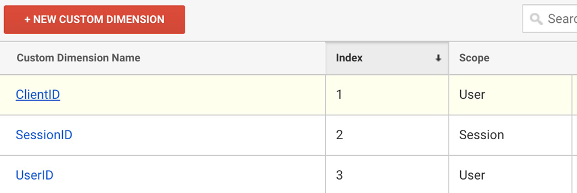

## 2. Set up ClientId and SessionId tracking on Shopify Store

1. Go to `Online Store > Themes`.
1. Find Theme libary `Actions` dropdown, click on `Edit code`. Duplicate the theme before editing for backup purpose.

   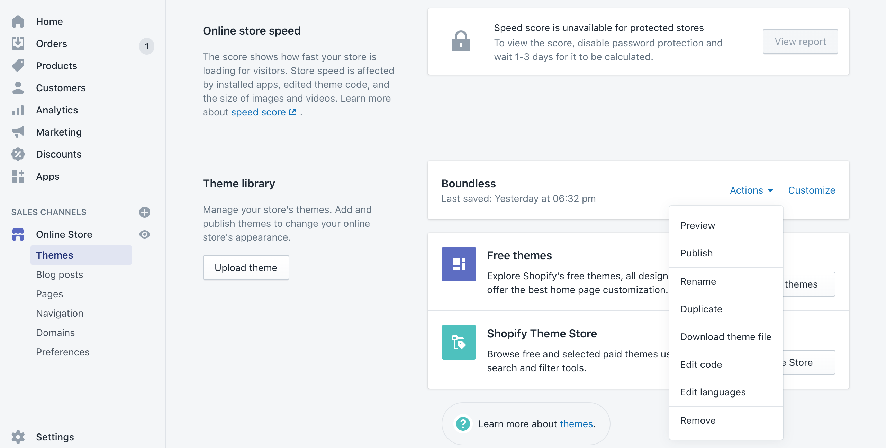

1. Click on `Add new snippet` from the sidebar. Create the snippet with `dblue-ga-tracker` name.

   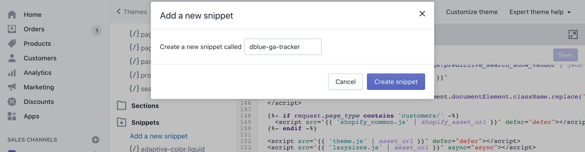

1. Change the following variables in the code snippet

   - `trackerId` - Your Google Analytics Tracking code
   - `clientIdDimensionIndex` - ClientId custom dimension index
   - `sessionIdDimensionIndex` - SessionId custom dimension index
   - `userIdDimensionIndex` - UserId custom dimension index
   - `hitIdDimensionIndex` - HitId custom dimension index
   - `hitTimestampDimensionIndex` - HitTimestamp custom dimension index
   - `hitTypeDimensionIndex` - HitType custom dimension index

1. Place the modified code snippet in the newly created `dblue-ga-tracker.liquid` file and click on `Save`

   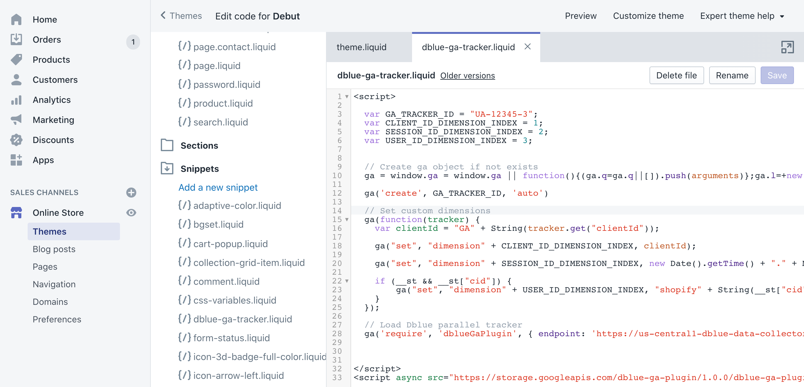

1. Select `theme.liquid` file from the sidebar, place `` code just before the closing of `</head>` tag and click on `Save`

   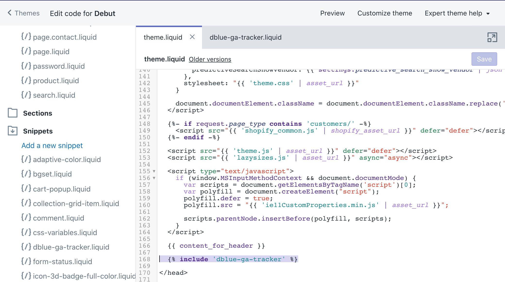

1. Also, place the content of `dblue-ga-tracker.liquid` in `Settings > Checkount` Additional scripts box, and click on `Save`.

   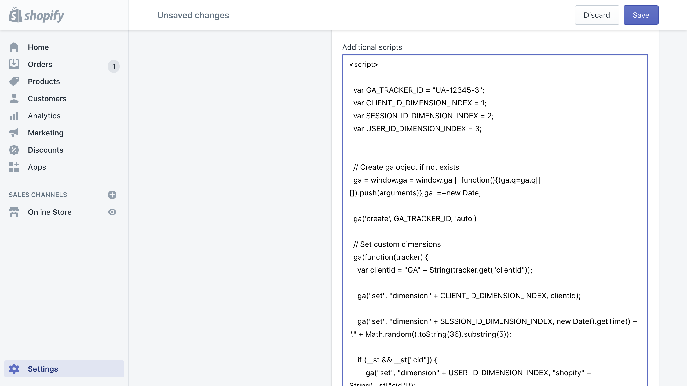

#### Code snippet

Get code snippet from `shopify-code.html` file

## 3. Create Google Analytics Reporting API Credentials

This part includes creating API credentials to authenticating the Google Analytics Reporting API and access the data. The setup will need access to [Google Developer Console](https://console.developers.google.com/).

1. Create Google Cloud Project

   - Click on NEW PROJECT button

   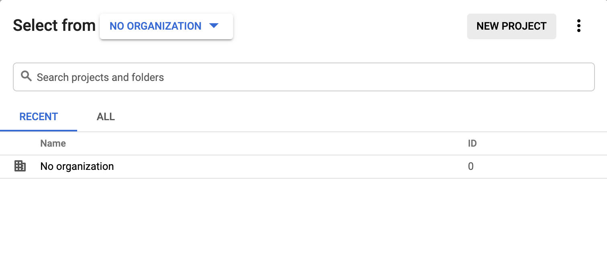

   - Fill in the details as per your organization needs

   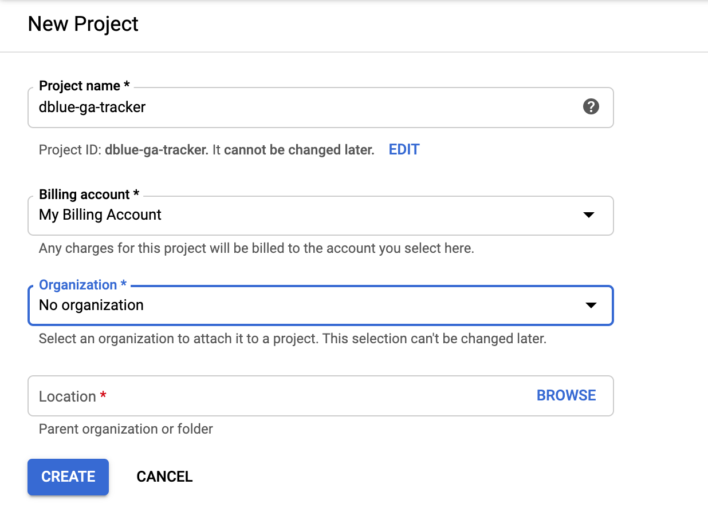

1. Enable Google Analytics Reporting API

   - Search for Google Analytics Reporting API

   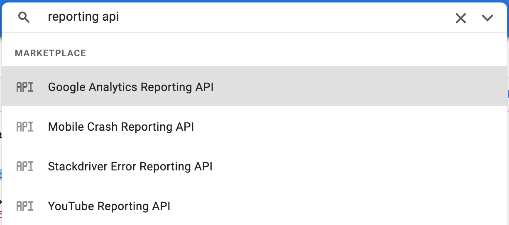

   - Click on Enable button

   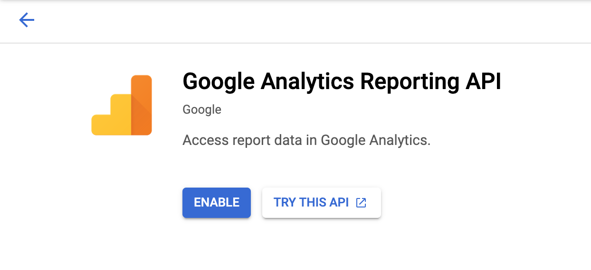

1. Create API credentials

Going back to the main page of the Google Developers console, go to the Credentials tab and click the Manage service accounts link. This will go to the IAM & Admin console, where you can click the +CREATE SERVICE ACCOUNT button. This will open the Create Service Account dialog. Add a name and select the Role or Project > Viewer.

Check the Furnish a new private key checkbox and choose the JSON format. After saving the form, a JSON file with the API credentials will be downloaded.
